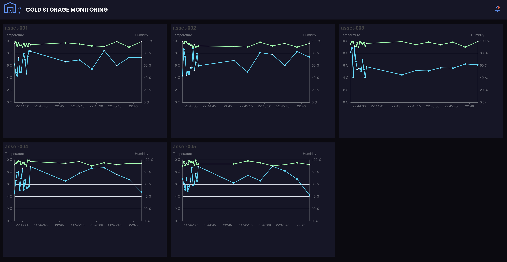
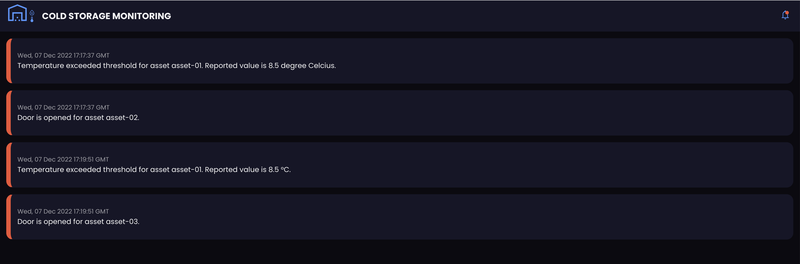

# mongodb-atlas-cold-storage-monitoring
Cold Storage monitoring dashboard built using React and Atlas App. The dashboard makes use of MongoDB changestreams to capture the realtime changes in the database and shows the realtime updates and alerts. This project also includes the simulator to simulate the Cold Storage IoT device data. Alerts are triggered using Atlas Trigger

## Simulator
The simulator is a Java CLI application. For convenience the built jar is checked in. The same can be used to start the simulation.
### Pre-requisites
- JDK 17
### Build
To build the jar use the below command

<code>./gradlew bootJar</code>

The built jar will be available in path build/libs/data-simulator-0.0.1-SNAPSHOT.jar

### Start the simulation 
To start the simulation execute the jar.

<code>java -jar data-simulator-0.0.1-SNAPSHOT.jar -conn [Database connection String] -db iot -coll timeseries -n 6 </code>

For CLI help use below command

<code>java -jar data-simulator-0.0.1-SNAPSHOT.jar -h </code>

## Alerts Trigger
To create alert trigger follow the below steps
- Navigate to the Data Services -> Tiggers from Atlas homepage
- Click Add Trigger button on the right top corner
- Choose trigger type as <b>Database</b>, configure the datasource and select timeseries collection
- Choose event type as <b>Function</b> and copy the code avaiable in atlas-trigger/function.js
- Update the <Cluster Name> with the name of your cluster and save the function
  
 ## Cold Storage Monitoring UI
  The UI is built using React with Realm-web SDK
  - We can use the Realm Web SDK to query MongoDB Atlas data directly from the browser with help Mongo App service
  - Once App service is configured for Mongo collection and respective rule are in place, we can authenticate with Mongo App service from web
  - And we can query respective collection and we can configure change stream to get a real time update to collection 
  
  
  
  
